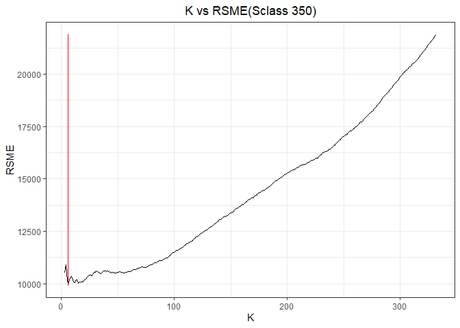
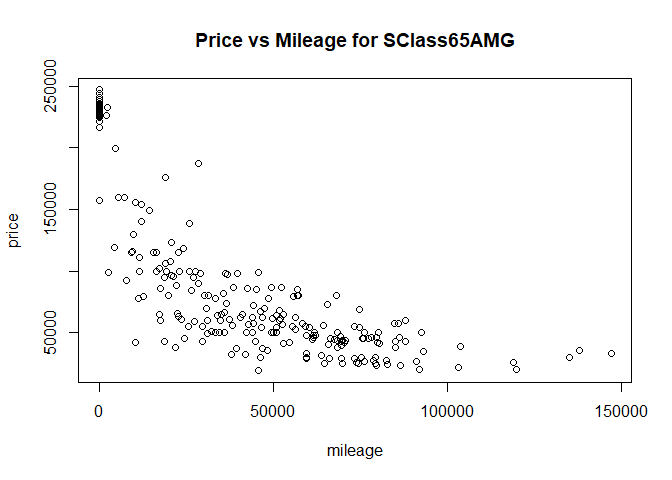
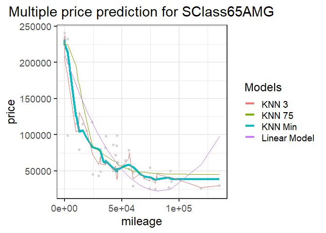

By Bernardo Magalhaes, Adhish Luitel, Ji Heon Shim

Exercise 1.2
============

We used K-nearest neighbors to build a predictive model for price, given
mileage, separately for each of two trim levels: 350 and 65 AMG. In
order to do this, we divided our data into 2 subgroups, 350 and 65 AMG,
and got rid of all the other data.

### Sclass 350

First, we’ll look on the Sclass 350 data. We can see there’s a negative
relationship between mileage and price plotted as below


And we splitted Sclass 350 data into two groups. One is “training set”,
and the other is “test set”. The training set accounts for 80% of whole
data.

Then we ran K-nearest-neighbors for k, starting from k=3 to higher
value. We faced an error when k=2, so the possible minimum value of k
was 3. The fitted model for k=3 is as below, and RSME is 10880.2


    ## [1] 9339.727

When k=20, The fitted model is as below. RSME is 9238.5, which is
smaller than RSME when k=3.


    ## [1] 8559.556

Now, the fitted model for k=100 below shows us the fact that the graph
gets smoother as k goes bigger. But RSME when k=100 is 10483.9, which is
bigger than that of when k=20. So it is probable that the optimal k that
minimizes RSME will be somewhere between k=3 and k=100.


    ## [1] 9929.078

In order to find the optimal k, we plotted k versus RSME for every k.
The graph below shows that RSME is minimized to 9134.4 when k equals to
18.  
The optimal value of k can vary whenever we run the regression because
samples are randomly chosen.



    ## [1] 5

    ## [1] 8287.092

The graph below shows the plot of the fitted value when k is the optimal
value.

 \#\#\# Sclass 65 AMG
Now, we’ll take the same step to find out the optimal k for subgroup
sclass 65 AMG. The plot below also shows us a negative relation between
price and mileage.



As we did on the Sclass 350 case, the Sclass 65 AMG data is also
splitted into two groups- a training set and a test set. The training
set accounts for 80% of whole data.

We’ll start with k=3, and run K-nearest-neighbors. The fitted model for
k=3 is as below, and RSME is 21822.8


    ## [1] 23561.11

When k=20, The fitted model is as below. RSME is 22546.5, which is
slightly bigger than RSME when k=3.


    ## [1] 19516.63

Now, the fitted model for k=100 below shows us the fact that the graph
gets smoother as k goes bigger. But RSME when k=100 is 40928.0, which is
much bigger than that of when k=20. So the optimal k that minimizes RSME
must be much smaller than 100.



    ## [1] 34164.83

In order to find the optimal k, we plotted k versus RSME for every k
value. The graph below shows that RSME is minimized to 21037.7 when k
equals to 4.


    ## [1] 9

    ## [1] 18134.53

The graph below shows the plot of fitted model when k is optimally
chosen.


In conclusion, the optimal k value was larger in subgroup Sclass 350
than sclass 65 AMG.  
There are more samples in 350 than in 65 AMG. So higher k can be
required to get more precise prediction. Besides, samples in 350 are
more dispersed than those in 65 AMG. The large variance of sample can be
one factor which requires high value of k.

``` r
count(sclass_350)
```

    ## # A tibble: 1 x 1
    ##       n
    ##   <int>
    ## 1   416

``` r
count(sclass_65AMG)
```

    ## # A tibble: 1 x 1
    ##       n
    ##   <int>
    ## 1   292
