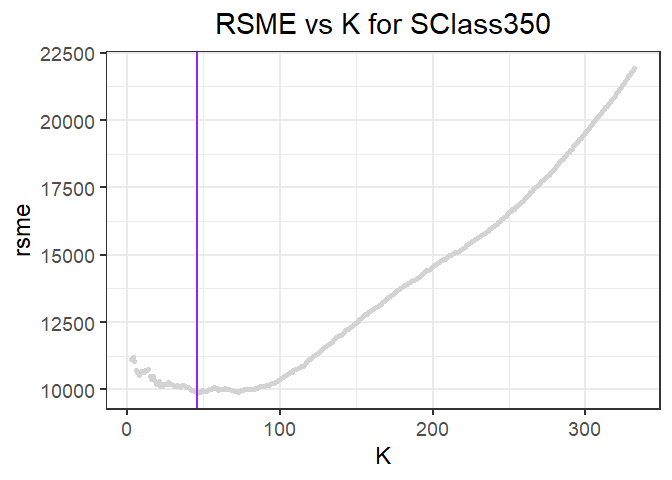

By Bernardo Magalhaes, Adhish Luitel, Ji Heon Shim

Exercise 1.2
============

We used K-nearest neighbors to build a predictive model for price, given
mileage, separately for each of two trim levels: 350 and 65 AMG. In
order to do this, we divided our data into 2 subgroups, 350 and 65 AMG,
and got rid of all the other data.

### Sclass 350

First, we’ll look on the Sclass 350 data. We can see there’s a negative
relationship between mileage and price plotted as below

And we splitted Sclass 350 data into two groups. One is “training set”,
and the other is “test set”. The training set accounts for 80% of whole
data.

Then we ran K-nearest-neighbors for k, starting from k=3 to higher
value. We faced an error when k=2, so the possible minimum value of k
was 3. The fitted model for k=3 is as below, and RSME is 10984.7.

    ## [1] 10332.48

When k=20, The fitted model is as below. RSME is 9636.9, which is
smaller than RSME when k=3.

    ## [1] 10861.9

Now, the fitted model for k=100 below shows us the fact that the graph
gets smoother as k goes bigger. But RSME when k=100 is 11988.9, which is
bigger than that of when k=20. So it is probable that the optimal k that
minimizes RSME will be somewhere between k=3 and k=100.

    ## [1] 12683.42

In order to find the optimal k, we plotted k versus RSME for every k.
The graph below shows that RSME is minimized to 9487.9 when k equals 10.

    ## [1] 10

    ## [1] 10148.6

    ## [1] 10

    ## [1] 10148.6
