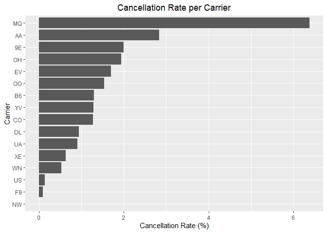
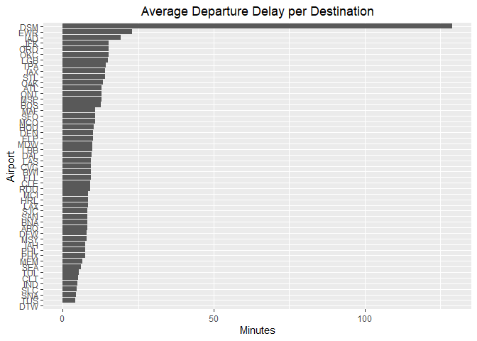
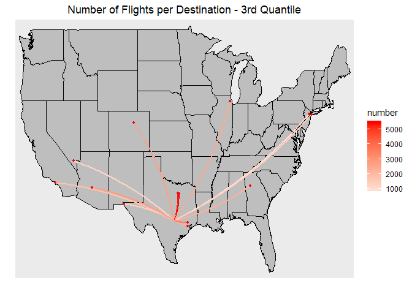
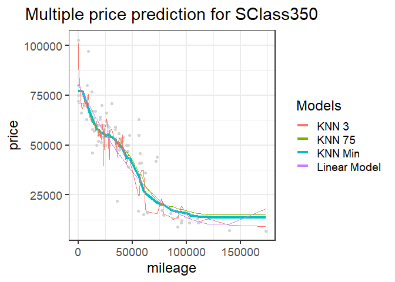
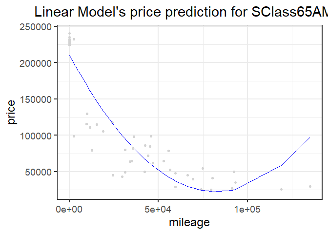
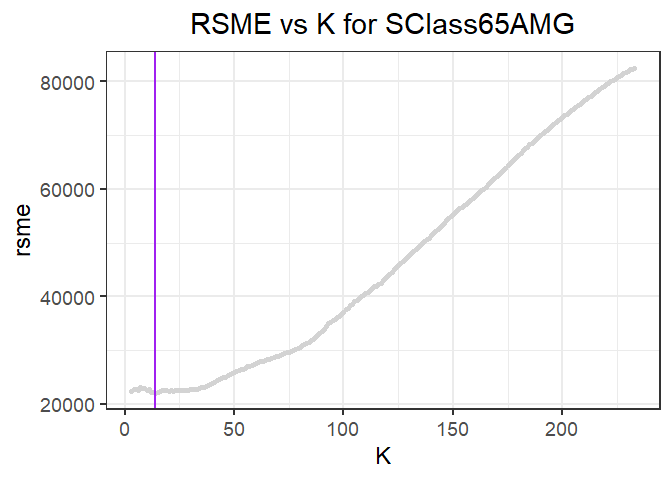

### Bernardo Arreal Magalhaes - UTEID ba25727

### Adhish Luitel - UTEID al49674

### Ji Heon Shim - UTEID js93996

Exercise 1
==========

Exercise 1.1
------------

In this question, we have all the data of flight information that arrive
at or depart from Austin-Bergstrom International Airport.

### Which airline has the highest cancellation rate?

First, we’ll have a close look on cancellation rates by airlines. Our
data shows that Envoy Air(formerly American Eagle Airlines, MQ), the
regional brand of American Airlines, has the highest cancellation rate
among all the airlines flying from Austin.

### Which destination is related to the longest departure delay?

Next, we examined all the flights departing from Austin, and arranged
departure delays by their destinations. Our analysis shows that DSM (Des
Moines International Airport - Iowa) is the destination which has the
longest average departure delay time from Austin. It is important to
notice that there was only one flight to this destination during the
entire year of 2008, what explains such a discrepancy from the other
destinations.  
The second one is EWR(Newark Liberty International Airport - NJ). There
were 941 flights flew from Austin to EWR in 2008, and the average
departure delay time was 20 minutes.

### What time of day does flight delay mostly occur?

Next, we arranged our departure delay data by scheduled departure time.
Our analysis shows that departure delays are most likely to happen
between 0 to 1 o’clock at night. We don’t know the exact explanation for
this, but among possible conjectures we think it might be due to the
fact that late night flights “carry-over” the delays accumulated during
the day since it operates with the aircrafts that are arriving from
other destinations. It might be the reason why late-night flights are
sold by lowest fares.

Now, we arranged our arrival delay data by scheduled arrival time. Our
analysis shows that arrival delays are most likely to happen between 22
to 23 o’clock at night. Again, we can reasonably argue that it might be
due to the “carry-over” effect of the delays accumulated during the day.

### Which month of year does flight delay mostly occur?

This time, we’ll extend our view from day to year to find out the month
in which flight delay mostly occurs. In case of departure delays from
Austin, December is the worst month if someone wants to avoid any
delays. If you depart from Austin in December, you’ll expect more than
15 minutes of delay on average - what matches with common sense that the
worst time of the year to fly is during holidays season.

December is the worst month again to avoid delays in case of arrival,
too. It is likely to be caused by an increase of flight demands at the
end of year.

### Which airline shows the longest delay time?

Now, we’ll see which airline company shows the longest delay time. In
case of departure delays, ExpressJet Airlines (EV) shows the worst
performance among all the airlines. The boxplot below shows that EV has
the largest median and variance. And the barplot also shows that average
departure delay time is the longest in EV.

In case of arrival delays, the box plot indicates us that PSA Airlines
(OH) has the the highest median and also unstable delay range by large
variance. The barplot below confirms this idea by showing the largest
average arrival delay time for OH.

### Suplemental analysis per destination.

When focusing on the most common destinations for flights departing from
ABIA, we can see that Dallas, Houston, Phoenix and Denver concentrate
approximately 40% of the flights leaving Austin.

When focusing on destinations that show a higher delay on average, we
observe that the pattern changes. Among possible conjectures, we believe
that bigger delays might occur when there is a less frequent operation
instead of a well established routine.

### Exercise 1.2

In this exercise, we used the K-nearest neighbors methodology to build a
predictive model for price given mileage, separately for each of two
trim levels of the Mercedes S-Class models: 350 and 65 AMG. First, we
divide our data into 2 subgroups, 350 and 65 AMG and define the Root
Mean Square Error (RSME) function. The RMSE gives the square root of the
second sample moment of the differences between predicted values and
observed values or the quadratic mean of these differences. These
deviations are the residuals, when off-sample these deviations are
called errors.

### Sclass 350

First we did a Price vs Mileage plotting of the SClass 350. The graph
indicates a negative relationship between mileage and price.

In supervised learning, we used a training dataset, containing 80% of
the outcomes(datapoints) randomly assigned, to train the machine. We
then used testing dataset that had the other 20% of the data to predict
outcomes. Given the fact that the dataset was randomly splitted and that
the sample size is limitted, it is important to note that one might come
up with different results every time.

We added a linear model to our analysis as a comparison metric as to our
hypothesis of how the prices should be falling as per the rise in
mileage.

Now, we ran K-nearest-neighbors for k, starting from k=3 to the sample
size. We faced an error when k=2 given the fact that the KNN function
requires a minimum k=3. From here, we use a for loop to our KNN
regression, storing all the y-predictors and rsme to evaluate the best
possible fit and compare.

The goal here is to find the optimal K which minimizes the RSME in the
test set.

After obtaining the optimal KKN we plotted the data to visualize our
best fit. We do a K vs. RSME graph assessing our best fit which
minimizes errors.

Then we plotted the prediction generated by the optimal K with the
observations, and compared this prediction with other Ks (k=3 and k=75)
and the linear model.

We need to realise that since we are taking randomized samples, the
optimal K changes and so would RSME. So our K and RSME would change
everytime we take a random sample and run a KNN regression. We found
that the optimal K was the following.

    ## [1] 46

The RSME associated with that K is the following.

    ## [1] 9883.814

Now we can do the same with the 65AMG trim.

### Sclass 65 AMG

Once again we started by plotting a Price vs Mileage graph of the SClass
65AMG. The graph indicates the same negative relationship between
mileage and price.

We again randomly splitted the data (this time the for the 65AMG model)
into two groups. One is “training set”, and the other is “test set”,
with the same shares as before. We ran the same linear model as before
in order to make comparisons with the different fitted values.

The linear model corroborates the idea that prices should be falling
mileage increases.

Again, for the 65AMG, we run K-nearest-neighbors for k, starting from
k=3 to the sample size. Just like before, we used a for loop to our KNN
regression and a y-predictor to find the best possible fit, with the
goal to find the optimal K which minimizes the RSME. We plotted a K
vs. RSME graph assessing out best fit which minimizes errors.

 Then just like
before, we plot k=3 and k=75. So in total we have K=3, k=75, minimizing
K and the linear model.

Like mentioned before, note that as we are taking random samples, the
optimal K changes and so would RSME everytime we take a different sample
and run a KNN regression.

We found that the optimal K was the following.

    ## [1] 14

The RSME associated with that K is the following.

    ## [1] 22044.06

We can see that the optimal k value is larger in subgroup 65 AMG than
sclass Sclass 350. However, we can’t assess whether it is due to a
different pattern or a difference in the randomization process.

In addition, samples in 350 are more dispersed than those in 65 AMG. The
large variance of sample can be aruged as the factor which yields to a
different value of k for the 350 sub-class.
