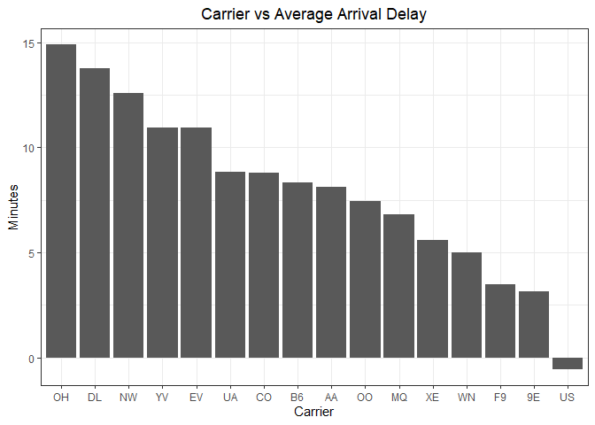
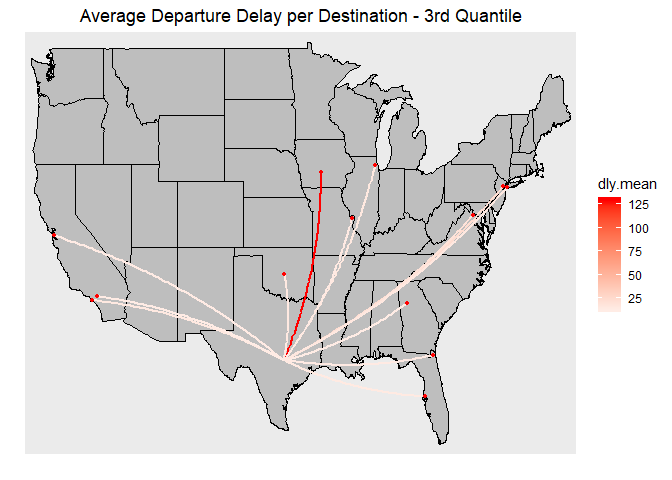
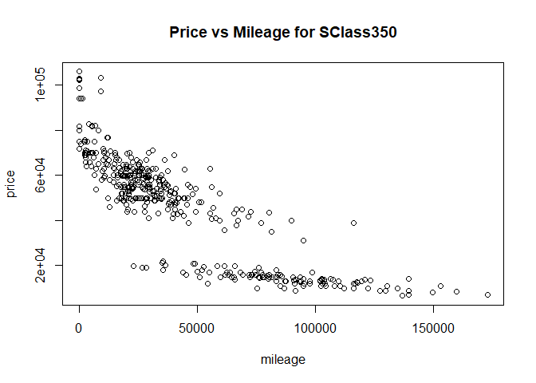
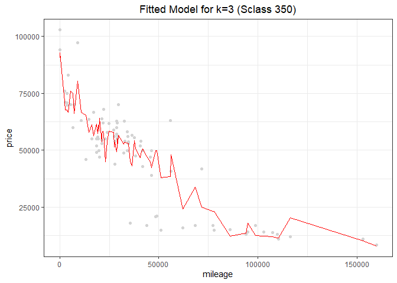
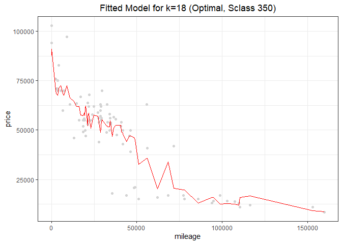
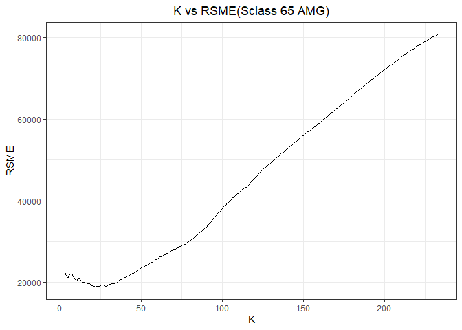
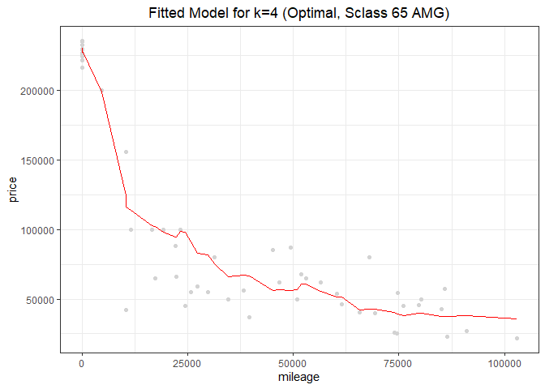

By Bernardo Magalhaes, Adhish Luitel, Ji Heon Shim \# Exercise 1

Exercise 1.1
------------

In this question, we have all the data of flight information that arrive
at or depart from Austin-Berstrom airport.

### Which airline company has the highest cancellation rate?

First, we’ll have a close look on cancellation rates by airline
companies. Our data shows that American Eagle airline(MQ) has the
highest cancellation rate among all the airlines flying through Austin.


### Which destination is likely to cause the longest departure delay?

Next, we examined all the aircrafts departing from Austin, and arranged
departure delays by their destinations. Our analysis shows that DSM(Des
Moines) is the destination which causes the most departure delay from
Austin.


### What time of day does flight delay mostly occur?

Next, we arranged our departure delay data by scheduled departure time.
Our analysis shows that departure delays are most likely to happen
between 0 to 1 o’clock at midnight. We don’t know the exact reason for
this, but bad sight due to darkness can be one of various reasons which
cause departure delays.


Now, we arranged our arrival delay data by scheduled arrival time. Our
analysis shows that arrival delays are most likely to happen between 22
to 23 o’clock at night. Again, we can guess that bad sight due to
darkness can be one of various reasons.


### Which month of year does flight delay mostly occur?

This time, we’ll extend our view from day to year to find out the month
which flight delay mostly occurs. In case of departure delays from
Austin, December is the worst month if someone wants to avoid any
delays. If you depart from Austin in December, you’ll expect more than
15 minutes of delay on average.


December is the worst month again to avoid delays in case of arrival,
too. It is likely to be caused by lots of flight demands at the end of
year.


### Which airline company shows the longest delay time?

Now, we’ll see which airline company shows the longest delay time. In
case of departure delays, ExpressJet airlines(EV) shows the worst
performance among all the airlines. The boxplot below shows that EV has
the largest median and variance. And the barplot also shows that average
departure delay time is the longest in EV.


In case of arrival delays, the box plot apparently gives us information
that PSA airline(OH) seems to have the highest median and also unstable
delay range by large variance. The barplot below confirms this idea by
showing the largest average arrival delay time for OH.



(text)


(text)



Exercise 1.2
============

We used K-nearest neighbors to build a predictive model for price, given
mileage, separately for each of two trim levels: 350 and 65 AMG. In
order to do this, we divided our data into 2 subgroups, 350 and 65 AMG,
and got rid of all the other data.

### Sclass 350

First, we’ll look on the Sclass 350 data. We can see there’s a negative
relationship between mileage and price plotted as below



And we splitted Sclass 350 data into two groups. One is “training set”,
and the other is “test set”. The training set accounts for 80% of whole
data.

Then we ran K-nearest-neighbors for k, starting from k=3 to higher
value. We faced an error when k=2, so the possible minimum value of k
was 3. The fitted model for k=3 is as below, and RSME is 10880.2



    ## [1] 10512.5

When k=20, The fitted model is as below. RSME is 9238.5, which is
smaller than RSME when k=3.


    ## [1] 10158.12

Now, the fitted model for k=100 below shows us the fact that the graph
gets smoother as k goes bigger. But RSME when k=100 is 10483.9, which is
bigger than that of when k=20. So it is probable that the optimal k that
minimizes RSME will be somewhere between k=3 and k=100.


    ## [1] 11497.94

In order to find the optimal k, we plotted k versus RSME for every k.
The graph below shows that RSME is minimized to 9134.4 when k equals to
18.  
The optimal value of k can vary whenever we run the regression because
samples are randomly chosen.


    ## [1] 6

    ## [1] 9933.825

The graph below shows the plot of the fitted value when k is the optimal
value.

 \#\#\# Sclass 65 AMG
Now, we’ll take the same step to find out the optimal k for subgroup
sclass 65 AMG. The plot below also shows us a negative relation between
price and mileage.


As we did on the Sclass 350 case, the Sclass 65 AMG data is also
splitted into two groups- a training set and a test set. The training
set accounts for 80% of whole data.

We’ll start with k=3, and run K-nearest-neighbors. The fitted model for
k=3 is as below, and RSME is 21822.8


    ## [1] 22525.31

When k=20, The fitted model is as below. RSME is 22546.5, which is
slightly bigger than RSME when k=3.


    ## [1] 19271.98

Now, the fitted model for k=100 below shows us the fact that the graph
gets smoother as k goes bigger. But RSME when k=100 is 40928.0, which is
much bigger than that of when k=20. So the optimal k that minimizes RSME
must be much smaller than 100.


    ## [1] 38148.78

In order to find the optimal k, we plotted k versus RSME for every k
value. The graph below shows that RSME is minimized to 21037.7 when k
equals to 4.



    ## [1] 22

    ## [1] 18954.5

The graph below shows the plot of fitted model when k is optimally
chosen.



In conclusion, the optimal k value was larger in subgroup Sclass 350
than sclass 65 AMG.  
There are more samples in 350 than in 65 AMG. So higher k can be
required to get more precise prediction. Besides, samples in 350 are
more dispersed than those in 65 AMG. The large variance of sample can be
one factor which requires high value of k.

``` r
count(sclass_350)
```

    ## # A tibble: 1 x 1
    ##       n
    ##   <int>
    ## 1   416

``` r
count(sclass_65AMG)
```

    ## # A tibble: 1 x 1
    ##       n
    ##   <int>
    ## 1   292
